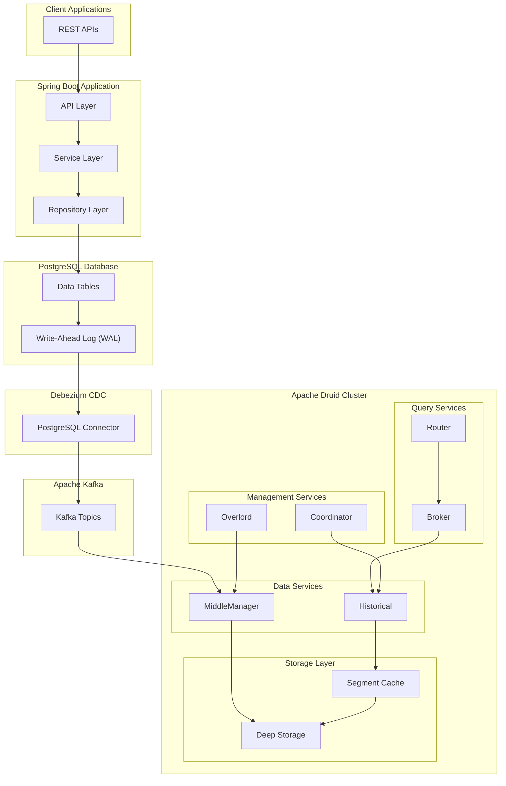

# PostgreSQL to Apache Druid Data Pipeline

This Spring boot project repository demonstrates how to set up a real-time data pipeline using PostgreSQL, Debezium for Change Data Capture (CDC), Kafka, and Apache Druid. The pipeline captures change events from a PostgreSQL database, streams them through Kafka, and ingests them into Apache Druid for real-time analytics.

---

# Table of Contents
1. [Introduction to Apache Druid](#introduction-to-apache-druid)  
   1.1 [Key Features](#key-features)  
2. [Druid Architecture](#druid-architecture)  
   2.1 [Druid Core Services](#1-druid-core-services)  
      2.1.1 [Query Services](#query-services)  
      2.1.2 [Data Services](#data-services)  
      2.1.3 [Management Services](#management-services)  
   2.2 [Data Organization](#2-data-organization)  
      2.2.1 [Segments](#segments)  
      2.2.2 [Storage Architecture](#storage-architecture)  
   2.3 [Ingestion](#3-ingestion)  
3. [Project Overview](#project-overview)  
4. [System Architecture](#system-architecture)  
5. [Architecture Components and Data Flow](#architecture-components-and-data-flow)  
   5.1 [Architecture Components](#architecture-components)  
   5.2 [Data Flow](#data-flow)  
6. [PostgreSQL Logical Replication](#postgresql-logical-replication)  
   6.1 [What is Logical Replication?](#1-what-is-logical-replication)  
   6.2 [Why it's Important](#2-why-its-important)  
   6.3 [Configuration](#3-configuration)  
   6.4 [Change Events Structure](#change-events-structure)  
7. [Prerequisites](#prerequisites)  
8. [Tech Stack](#tech-stack)  
9. [Project Structure](#project-structure)  
10. [Setup Instructions](#setup-instructions)  
11. [Services and Ports](#services-and-ports)  
12. [API Endpoints](#api-endpoints)  
13. [Data Pipeline Configuration](#data-pipeline-configuration)  
14. [Data Flow](#data-flow)  
15. [Querying Druid](#querying-druid)  
16. [Monitoring](#monitoring)  
17. [Troubleshooting](#troubleshooting)  
18. [Reference](#reference)
---

## Introduction to Apache Druid

Apache Druid is a high-performance, real-time analytics database designed to quickly ingest and query large datasets. It's particularly well-suited for:
- OLAP (Online Analytical Processing) queries
- Real-time analytics
- Time-series data analysis
- High-concurrency applications

### Key Features
- Real-time ingestion
- Sub-second queries
- High availability
- Scalable architecture
- Column-oriented storage
- Time-based partitioning

## Druid Architecture

### 1. Druid Core Services

#### Query Services
1. **Router Service**
   - Acts as the gateway to the Druid cluster
   - Provides unified API endpoint
   - Routes queries to appropriate services
   - Manages the web console UI
   - Default port: 8888

2. **Broker Service**
   - Receives and processes queries
   - Maintains metadata about segment locations
   - Merges results from Historical nodes
   - Implements query caching
   - Default port: 8082

#### Data Services
1. **Historical Service**
   - Stores and serves queryable data
   - Manages immutable data segments
   - Implements segment caching
   - Handles segment downloads from deep storage
   - Default port: 8083

2. **MiddleManager Service**
   - Manages ingestion tasks
   - Spawns Peon processes for task execution
   - Handles real-time data ingestion
   - Coordinates with Overlord for task management
   - Default port: 8091

3. **Peon Process**
   - Child processes of MiddleManager
   - Executes individual ingestion tasks
   - Manages resource allocation per task
   - Handles segment creation and publishing

#### Management Services
1. **Coordinator Service**
   - Manages data availability
   - Balances segment load across Historical nodes
   - Handles segment replication
   - Maintains cluster metadata
   - Default port: 8081

2. **Overlord Service**
   - Controls ingestion workflows
   - Distributes tasks to MiddleManagers
   - Monitors task status
   - Manages task queue
   - Often co-located with Coordinator

### 2. Data Organization

#### Segments
1. **Structure**
   - Time-chunked data blocks
   - Typically split by time intervals
   - Contains:
     - Columnar data store
     - Bitmap indexes
     - Time indexes
     - Metadata

2. **Lifecycle**
   ```mermaid
   graph LR
   A[Real-time Data] --> B[Ingestion]
   B --> C[Memory Buffer]
   C --> D[Persist to Disk]
   D --> E[Deep Storage]
   E --> F[Historical Nodes]
   ```

#### Storage Architecture
1. **Deep Storage**
   - Permanent backup storage
   - Supports multiple backends:
     - Local disk
     - S3
     - HDFS
     - Google Cloud Storage
   - Used for segment persistence
   - Enables fault tolerance

2. **Segment Cache**
   - Local storage on Historical nodes
   - Memory-mapped segment files
   - LRU cache implementation
   - Configurable size limits

3. **Memory Buffer**
   - In-memory storage for real-time data
   - Periodic persistence to disk
   - Configurable flush size
   - Tunable memory limits

### 3. Ingestion

1. **Methods**
   - Batch ingestion (for historical data)
   - Stream ingestion (for real-time data)
   - SQL-based ingestion

2. **Formats Supported**
   - JSON, CSV, TSV, Parquet
   - Custom formats via extensions
   - Kafka and Kinesis streaming

---

## Project Overview

This project implements a data pipeline with the following components:
- Spring Boot application with REST APIs for Employee management
- PostgreSQL as the primary database
- Debezium for Change Data Capture
- Apache Kafka for message streaming
- Apache Druid for real-time analytics

## System Architecture



---

## Architecture Components and Data Flow

### Architecture Components

1. **Client Applications**
   - Interacts with the system through REST APIs
   - Sends CRUD operations for employee data

2. **Spring Boot Application**
   - API Layer: Handles HTTP requests and response formatting
   - Service Layer: Implements business logic and data validation
   - Repository Layer: Manages database operations

3. **PostgreSQL Database**
   - Stores employee data
   - Write-Ahead Log (WAL) enables change data capture
   - Configured with logical replication

4. **Debezium CDC**
   - PostgreSQL Connector monitors WAL for changes
   - Captures INSERT, UPDATE, and DELETE operations
   - Maintains transaction order and metadata

5. **Apache Kafka**
   - Receives change events from Debezium
   - Provides reliable message queue
   - Enables scalable data streaming

6. **Apache Druid Cluster**
   - Query Services:
     - Router: Entry point for queries
     - Broker: Manages query distribution
   - Management Services:
     - Coordinator: Handles data availability
     - Overlord: Controls ingestion workflows
   - Data Services:
     - Historical: Stores queryable data
     - MiddleManager: Manages ingestion tasks
   - Storage Layer:
     - Deep Storage: Permanent data storage
     - Segment Cache: Local data cache

### Data Flow

1. Client applications interact with REST APIs
2. Spring Boot processes requests and updates PostgreSQL
3. Debezium captures changes from PostgreSQL WAL
4. Changes are published to Kafka topics
5. Druid ingests data from Kafka
6. Data becomes available for real-time analytics


## PostgreSQL Logical Replication

This project uses PostgreSQL's logical replication feature, which is crucial for Change Data Capture (CDC). Here's why:

1. **What Is Logical Replication?**
   - Replicates data changes at a logical level (row changes)
   - Enables filtering of specific tables and operations
   - Provides structured change events

2. **Why It's Important**
   - Enables real-time data capture without performance impact
   - Preserves transaction boundaries
   - Allows selective replication of specific tables
   - Essential for CDC tools like Debezium

3. **Configuration**
    - **PostgreSQL Settings**
        
        ```sql
        wal_level = logical  # Enables logical decoding
        ```
        This is configured in our `docker-compose.yml`:
        ```yaml
        command: ["postgres", "-c", "wal_level=logical"]
        ```
         Example:
        ```yaml
        postgres:
          container_name: postgres
          image: postgres:latest
          ports:
            - "5432:5432"
          volumes:
            - metadata_data:/var/lib/postgresql/data
          environment:
            - POSTGRES_DB=demo-druid
            - POSTGRES_USER=postgres
            - POSTGRES_PASSWORD=root
          # Enable logical replication for PostgreSQL
          command: ["postgres", "-c", "wal_level=logical"] #Logical replication is required when using tools like Debezium to stream changes from PostgreSQL to other systems (e.g., Kafka).
          networks:
            - druid_network
        ```

    - **Replication Slot**
      - Name: "debezium"
      - Plugin: "pgoutput"
      - Created automatically by Debezium connector

    - **Publication Setup**
      ```sql
      CREATE PUBLICATION dbz_publication FOR TABLE public.employee;
      ```

    ## Change Events Structure
      Example of a captured change event:
      ```json
      {
        "before": null,
        "after": {
          "id": 1,
          "name": "Ram",
          "email": "ram@example.com",
          "contact": "1234567890"
        },
        "source": {
          "version": "1.9.7.Final",
          "connector": "postgresql",
          "name": "dbserver1",
          "schema": "public",
          "table": "employee"
        },
        "op": "c"
      }
      ```


## Prerequisites

- Docker and Docker Compose
- Java 21
- Gradle
- curl (for testing)

## Tech Stack

- Spring Boot 3.4.0
- Apache Druid 31.0.0
- PostgreSQL (latest)
- Apache Kafka (Debezium distribution)
- Apache ZooKeeper 3.5.10
- Debezium Connect

## Project Structure

```
demo-druid/
├── src/
│   └── main/
│       ├── java/
│       │   └── com/example/
│       │       ├── controller/
│       │       ├── model/
│       │       ├── repository/
│       │       └── service/
│       └── resources/
│           └── application.properties
├── docker-compose.yml
├── dockerfile
├── environment
├── postgresql-data-source.json
├── druid-ingestion-spec.json
└── build.gradle
```

## Setup Instructions

1. Clone the repository:
   ```bash
   git clone https://github.com/Jayesh2026/druid-cluster-demo.git
   cd druid-cluster-demo
   ```

2. Build the Spring Boot application:
   ```bash
   ./gradlew build
   ```

3. Start the containers:
   ```bash
   docker-compose up -d
   ```

4. Configure Debezium connector:
   ```bash
   curl -X POST -H "Content-Type: application/json" -d @postgresql-data-source.json http://localhost:8083/connectors
   ```
   OR Using Postman:
   
 - **URL**: `POST http://localhost:8083/connectors`
   - **Body**:
     ```json
     {
       "name": "postgresql-data-source",
       "config": {
         "connector.class": "io.debezium.connector.postgresql.PostgresConnector",
         "tasks.max": "1",
         "database.hostname": "postgres",
         "database.port": "5432",
         "database.user": "postgres",
         "database.password": "root",
         "database.dbname": "demo-druid",
         "database.server.name": "dbserver1",
         "schema.include.list": "public",
         "table.include.list": "public.employee",
         "plugin.name": "pgoutput",
         "slot.name": "debezium",
         "publication.name": "dbz_publication"
       }
     }
     ```

6. Submit Druid ingestion task:
   ```bash
   curl -X POST -H "Content-Type: application/json" -d @druid-ingestion-spec.json http://localhost:8081/druid/indexer/v1/supervisor
   ```
   OR 
   Submit Druid ingestion task using Postman:
   
   - **URL**: ` POST http://localhost:8081/druid/indexer/v1/supervisor`
   - **Body**: [Check druid-ingestion-spec.json file]

   OR Using Druid Web Console:
      1. Open the Druid Web Console at `localhost:8888`.
      2. Navigate to the **Load Data** section.
      3. Select **Stream Ingestion**.
      4. Choose **Kafka** as the data source.
      5. Connect your Kafka data source by providing the necessary details.
      6. **Edit the Spec** to customize your ingestion process:
         - Either edit the ingestion spec directly.
         - Or paste the `druid-ingestion-spec.json` into the spec editor.
         
      For more details, refer to the [Medium document link] at the bottom.

   ```mermaid
   graph LR
   A["Open Druid Web Console<br> (localhost:8888)"] --> B[Load Data]
   B --> C[Stream ingestion]
   C --> D[Kafka]
   D --> E[Connect Data]
   E --> F[Edit Spec]
   F --> G[Paste druid-ingestion-spec.json<br> or Customize]
   ```
   

## Services and Ports

- Spring Boot Application: `http://localhost:8080`
- PostgreSQL: `localhost:5432`
- ZooKeeper: `localhost:2181`
- Kafka: `localhost:9092`
- Kafka Connect: `http://localhost:8083`
- Druid Coordinator: `http://localhost:8081`
- Druid Broker: `http://localhost:8082`
- Druid Router: `http://localhost:8888`
- Druid Historical: `http://localhost:8093`
- Druid MiddleManager: `http://localhost:8091`

## API Endpoints

### Employee Management
- `POST /api/employees` - Create new employee
- `GET /api/employees` - Get all employees
- `GET /api/employees/{id}` - Get employee by ID
- `PUT /api/employees/{id}` - Update employee
- `DELETE /api/employees/{id}` - Delete employee

Example request body:
```json
{
  "name": "Ram",
  "email": "ram@example.com",
  "contact": "1234567890"
}
```

## Data Pipeline Configuration

### 1. Debezium PostgreSQL Connector
The connector captures changes from PostgreSQL's Write-Ahead Log (WAL) and publishes them to Kafka. Configuration is in `postgresql-data-source.json`.

### 2. Druid Ingestion Specification
The ingestion specification (`druid-ingestion-spec.json`) defines how Druid processes data from Kafka:

#### Key Components:
- **Data Source**: `postgresql-data-source`
- **Dimensions**: `id`, `name`, `email`, `contact`
- **Metrics**: Row count
- **Kafka Topic**: `dbserver1.public.employee`
- **Parse Configuration**: JSON with field extraction paths

#### Performance Tuning:
- Memory Management:
  - Max rows in memory: 1,000,000
  - Max total rows: 10,000,000
- Task Configuration:
  - Task count: 4
  - Max concurrent subtasks: 4
- Error Handling:
  - Max parse exceptions: 10
  - Max saved parse exceptions: 5

## Data Flow

1. Spring Boot application writes to PostgreSQL
2. Debezium captures changes from PostgreSQL WAL
3. Changes are published to Kafka topics
4. Druid ingests data from Kafka topics using the specified ingestion configuration
5. Data becomes available for real-time analytics in Druid

## Querying Druid

Example queries can be executed through the Druid Router:

1. Count total employees:
```sql
SELECT COUNT(*) FROM "postgresql-data-source"
```

2. Group by email domain:
```sql
SELECT 
  SUBSTRING(email, POSITION('@' IN email) + 1) AS domain,
  COUNT(*) AS "count"
FROM "postgresql-data-source"
GROUP BY SUBSTRING(email, POSITION('@' IN email) + 1)
```

## Monitoring

### 1. Druid Console (`http://localhost:8888`)
- Supervisor status
- Ingestion metrics
- Query performance

### 2. Kafka Connect Status
```bash
curl http://localhost:8083/connectors/postgresql-data-source/status
```

### 3. Ingestion Metrics
```bash
curl http://localhost:8081/druid/indexer/v1/supervisor/postgresql-data-source/stats
```

## Troubleshooting

1. Verify Kafka topics:
```bash
docker exec -it kafka kafka-topics --list --bootstrap-server localhost:9092
```

2. Check Debezium connector status:
```bash
curl http://localhost:8083/connectors/postgresql-data-source/status
```

3. Monitor Druid ingestion:
```bash
curl http://localhost:8081/druid/indexer/v1/supervisor/postgresql-data-source/status
```

4. Common Issues:
   - If Kafka Connect fails, check connector logs
   - For parsing errors, check Druid's ingestion logs
   - Verify PostgreSQL replication slot status


## Reference
   - [Debezium Documentation](https://debezium.io/documentation)
   - [Apache Druid Documentation](https://druid.apache.org/docs/latest/)
   - [Apache Kafka Documentation](https://kafka.apache.org/documentation/)
   - [Medium Reference for Druid cluster setup](https://pushkar-sre.medium.com/druid-cluster-setup-6123bb921376)


